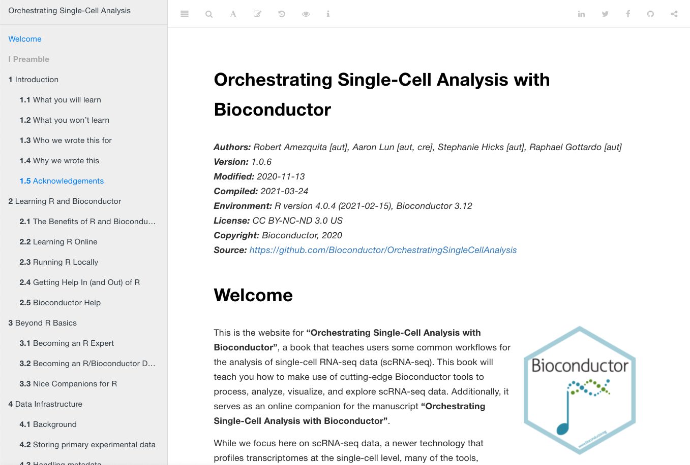

```{r, include = FALSE}
knitr::opts_chunk$set(
  collapse = TRUE,
  comment = "#>"
)
```

Last updated: `r Sys.Date()`


## Spatially resolved transcriptomics (ST)

Spatially resolved transcriptomics (ST) refers to new technological platforms that allow measuring up to transcriptome-wide gene expression with spatial resolution, e.g. spatial coordinates of the measurements on a tissue slide. Depending on the platform and tissue type, the spatial resolution can be multiple cells per coordinate, approximately single-cell, or sub-cellular.

By combining transcriptome-wide molecular information and spatial information, these platforms can provide powerful new biological insights. For example, we can investigate the spatial distribution of cell types on a tissue sample, colocalization of cell types, or spatial gradients of expression.

Examples of ST platforms include 10x Genomics Visium, Slide-seqV2, seqFISH+, and MERFISH.

Platforms may be grouped into spot-based (transcriptome-wide expression measured at a set of fixed spatial coordinates referred to as spots, e.g. 10x Genomics Visium and Slide-seqV2) and molecule-based (individual RNA molecules and their spatial coordinates are recorded, e.g. seqFISH+ and MERFISH).

For more details, see the chapter [Spatially resolved transcriptomics](https://lmweber.org/OSTA-book/spatially-resolved-transcriptomics.html) in OSTA, as well as the introductory vignette in our [SpatialExperiment workshop](https://drighelli.github.io/SpatialExperiment_Bioc2021/index.html).

```{r, echo=FALSE, out.width="100%", fig.align="center", fig.cap="ST example from the 10x Genomics Visium platform. Image source: [10x Genomics Visium website](https://www.10xgenomics.com/products/spatial-gene-expression)."}

```


## 10x Genomics Visium platform

For this workshop, we use example datasets from the commercially available [10x Genomics Visium](https://www.10xgenomics.com/products/spatial-gene-expression) platform.

The following schematic illustrates how this platform works.

This gives us a set of transcriptome-wide expression counts on a grid of approximately 5,000 spots, on a tissue slide with a capture area of size 6.5mm x 6.5mm.

```{r, echo=FALSE, out.width="100%", fig.align="center", fig.cap="Schematic of 10x Genomics Visium platform. Image source: [10x Genomics Visium website](https://www.10xgenomics.com/products/spatial-gene-expression)."}
knitr::include_graphics("../inst/images/Visium_schematic.png")
```


## Data structure

For each Visium sample, we obtain a matrix of read counts for up to 5,000 spots, as illustrated below. Note that in the Bioconductor format in [SpatialExperiment](https://bioconductor.org/packages/SpatialExperiment), this is stored in the transposed format with genes in rows and spots in columns.

In addition, we have the image of the tissue slide (described in the following sections), which allows us to align the molecular and spatial information.

```{r, echo=FALSE, out.width="35%", fig.align="center", fig.cap="Schematic of data format from 10x Genomics Visium platform."}

```


## Single-cell analyses

As an initial approximation, spot-based ST data (e.g. from the Visium platform) can be thought of as similar to single-cell RNA sequencing data, with measurements performed at the level of spots instead of individual cells.

This provides an excellent starting point for computational analyses, since we have access to a [huge number](https://www.scrna-tools.org/) of existing analysis tools for single-cell data, many of them within the Bioconductor framework.

Here, we note that the [OSCA](https://bioconductor.org/books/release/OSCA/) book ("Orchestrating Single-Cell Analysis with Bioconductor", [Amezquita et al. 2019](https://www.nature.com/articles/s41592-019-0654-x)) is an excellent resource if you are interested in analyzing single-cell data with Bioconductor (and was the inspiration for developing OSTA for ST data).

However, this approximation (spots as equivalent to cells) is not perfect -- spots may contain zero, one, or many cells -- and in addition it ignores any additional information contained in the spatial relationships or distances between spots.

```{r, echo=FALSE, out.width="70%", fig.align="center", fig.cap="Screenshot of [OSCA]](https://bioconductor.org/books/release/OSCA/) online book."}

```


## How to analyze ST data?

This leads us to the question -- how best to analyze ST data?

In the [OSTA](https://lmweber.org/OSTA-book/) book ("Orchestrating Spatially Resolved Transcriptomics Analysis with Bioconductor"), we describe the steps in a computational analysis pipeline for spatially resolved transcriptomics (ST) data, using the Bioconductor framework in R, along with examples of R code and datasets.

We begin by describing preprocessing steps and how to load the data into R using the [SpatialExperiment](https://bioconductor.org/packages/SpatialExperiment) object class, followed by downstream analysis steps. Since ST platforms and analysis methods are still new, we largely rely on standard downstream analysis methods originally developed for single-cell data. These methods have been rigorously tested and evaluated on single-cell data, including in independent benchmarks, and are available as Bioconductor packages.

In the future, we expect a growing number of methods will be developed specifically for ST data, which will enable new types of analyses and biological insights. For example, this may include methods for:

- spatially aware feature selection, e.g. spatially variable genes
- spatially aware clustering
- deconvolution of cell types in the spatial context

Once these new methods have been rigorously evaluated and implemented within the Bioconductor framework, we will demonstrate them within the OSTA workflows.

