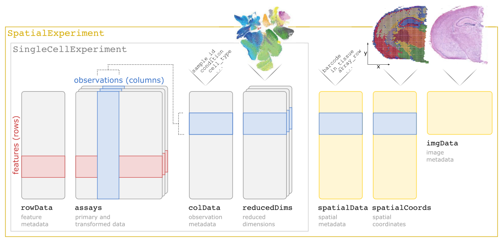

```{r, include = FALSE}
knitr::opts_chunk$set(
  collapse = TRUE,
  comment = "#>"
)
```

Last updated: `r Sys.Date()`


## Example dataset: human brain DLPFC region

For the examples in this workshop, we use a human brain dataset from the [10x Genomics Visium](https://www.10xgenomics.com/products/spatial-gene-expression) platform, which was previously described in our publication [Maynard and Collado-Torres et al. (2021)](https://www.nature.com/articles/s41593-020-00787-0).

The example dataset consists of a single sample from the human brain dorsolateral prefrontal cortex (DLPFC) region. This region contains six cortical layers and white matter, which can be distinguished by their molecular expression profiles, and have a layered spatial structure.

The full dataset contains 12 samples in total, from 3 individuals, with 2 pairs of "spatially adjacent" replicates (serial sections) per individual (4 samples per individual). The individuals and spatially adjacent replicates can be considered as blocking factors. Each sample spans the six layers of the cortex plus white matter in a perpendicular tissue section.

For the examples in this workshop, we use a single sample from this dataset (sample 151673).

For more details, see [Maynard and Collado-Torres et al. (2021)](https://www.nature.com/articles/s41593-020-00787-0). The full dataset is publicly available through the [spatialLIBD](http://bioconductor.org/packages/spatialLIBD) Bioconductor package, and the analysis code from our paper is provided in the [HumanPilot](https://github.com/LieberInstitute/HumanPilot) GitHub repository. The dataset can also be explored interactively through the [spatialLIBD Shiny web app](http://spatial.libd.org/spatialLIBD/).


## Preprocessing steps

After performing the Visium experiment, there are several steps needed to process the data and load it into R for downstream analysis.

These steps are described in detail in the [Preprocessing steps](https://lmweber.org/OSTA-book/preprocessing-steps.html) part in OSTA. Here, we provide a short overview and links.


## Image segmentation and cell counting

The first step is to process the raw images, which includes splitting multiple capture areas into individual samples, segmenting cell nuclei, and identifying the number of cells per spot.

For more details, see the chapter [Image segmentation (Visium)](https://lmweber.org/OSTA-book/image-segmentation-visium.html) in OSTA, as well as the paper [Tippani et al. (2021)](https://www.biorxiv.org/content/10.1101/2021.08.04.452489v1) describing the [VistoSeg](http://research.libd.org/VistoSeg/) tool.

Note that part of this step also requires the Space Ranger outputs described next.


## Loupe Browser and Space Ranger

The [Loupe Browser](https://www.10xgenomics.com/products/loupe-browser) and [Space Ranger](https://support.10xgenomics.com/spatial-gene-expression/software/pipelines/latest/what-is-space-ranger) software provided by 10x Genomics are used to align sequencing reads, match the sequencing data to the spatial coordinates on the image, as well as an initial inspection of data quality and exploration of the data.

For more details, see chapters [Loupe Browser (Visium)](https://lmweber.org/OSTA-book/loupe-browser-visium.html) and [Space Ranger (Visium)](https://lmweber.org/OSTA-book/space-ranger-visium.html) in OSTA.


## SpatialExperiment

After running Loupe Browser and Space Ranger, we are ready to load the data into R.

For this, we use the [SpatialExperiment](https://bioconductor.org/packages/SpatialExperiment) data structure. For more details, see the [SpatialExperiment](https://lmweber.org/OSTA-book/spatialexperiment.html) chapter in OSTA, or our additional [SpatialExperiment workshop](https://drighelli.github.io/SpatialExperiment_Bioc2021/index.html).

The schematic below illustrates the `SpatialExperiment` structure, which extends [SingleCellExperiment](https://bioconductor.org/packages/SingleCellExperiment) to include additional spatial and image information. The structure is flexible, and has been designed to work with data from 10x Genomics Visium as well as other spot-based and molecule-based ST platforms.

```{r, echo=FALSE, out.width="100%", fig.align="center", fig.cap="Schematic illustrating [SpatialExperiment](https://bioconductor.org/packages/SpatialExperiment) class structure."}

```

